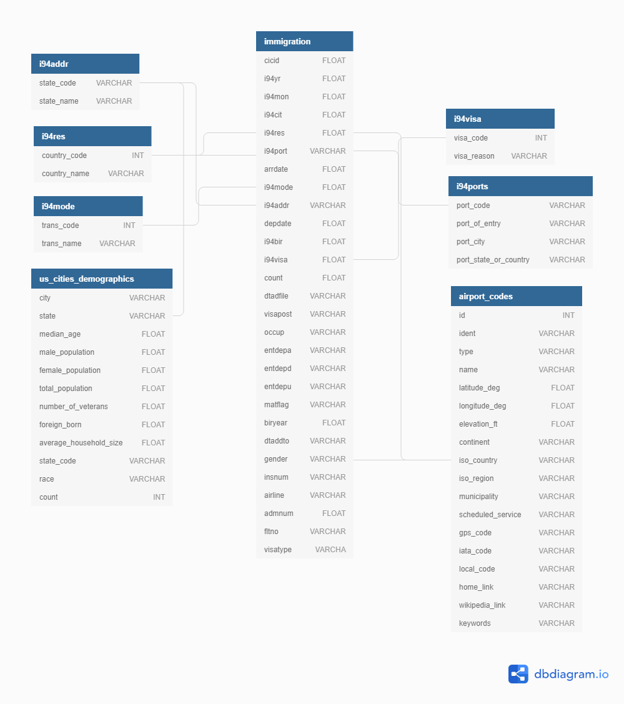
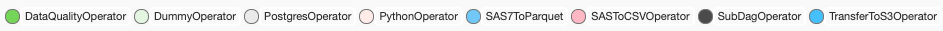
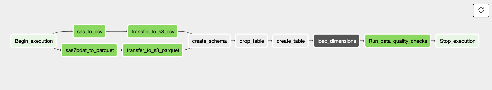
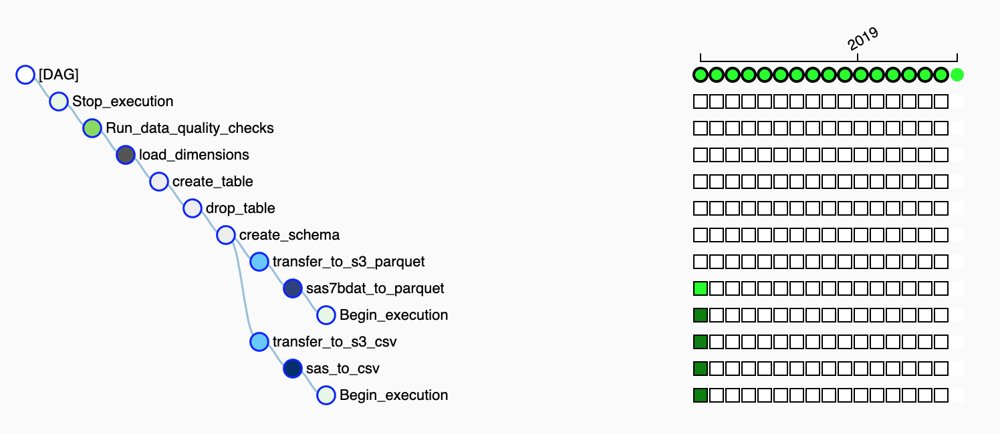
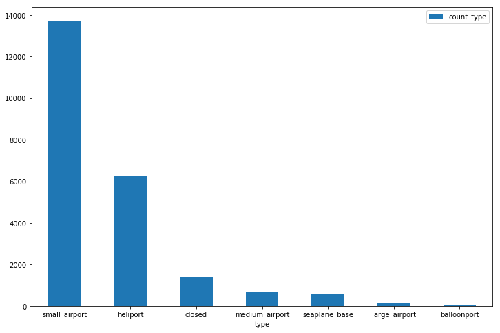
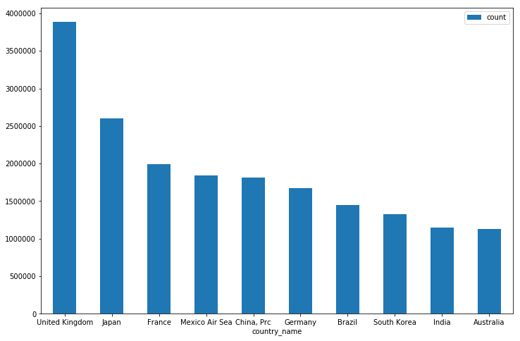
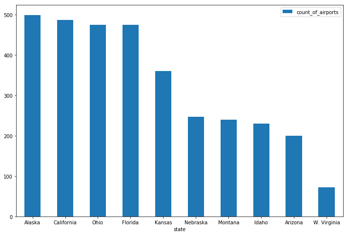
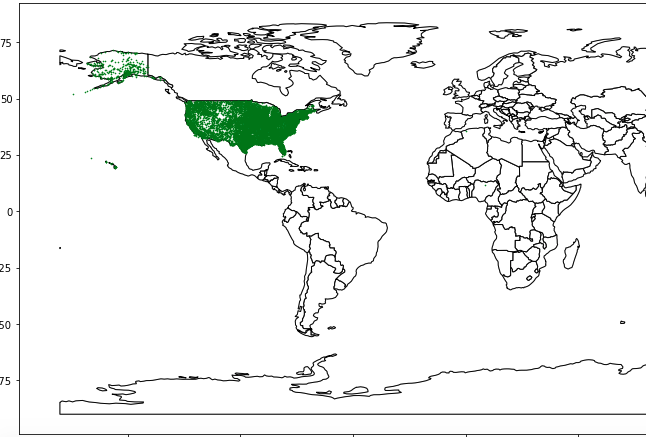

## Data Engineering Capstone Project for Udacity

### Objective  

---
In this project we are going to work with US immigraton data from the 
year 1994. We have facts such as visa types, transport modes, landing 
ports, us state codes, country codes. Apart from the sas7bdat formatted
immigration data we have us airport information and us demographics 
data. We are going to parse SAS descriptor files for all the dimensions 
and sas7bdat files for all the facts. The tools we are going to use here
are Apache Spark, Apache Airflow, Amazon Redshift, Amazon S3. 

We will be reading, parsing and cleaning the data from local file
systems, Amazon S3 and transferring data to redshift tables in AWS. We
will be orchestrating the flow of data through Apache Airflow DAGs. 

Finally we will be using some SQL queries to extract some valuable stats
and graphs from the data itself. 

### Data Model

---


### Data Pipeline

___




### Installing and starting

---

#### Installing Python Dependencies
You need to install this python dependencies
In Terminal/CommandPrompt:  

without anaconda you can do this:
```
$ python3 -m venv virtual-env-name
$ source virtual-env-name/bin/activate
$ pip install -r requirements.txt
```
with anaconda you can do this (in Windows):
```
$ conda env create -f env.yml
$ source activate <conda-env-name>
```
or (in Others)
```
conda create -y -n <conda-env-name> python==3.6
conda install -f -y -q -n <conda-env-name> -c conda-forge --file requirements.txt
[source activate/ conda activate] <conda-env-name>
```
#### Fixing/Configuring Airflow
```
$ pip install --upgrade Flask
$ pip install zappa
$ mkdir airflow_home
$ export AIRFLOW_HOME=./airflow_home
$ cd airflow_home
$ airflow initdb
$ airflow webserver
$ airflow scheduler
```

#### More Airflow commands
To list existing dags registered with airflow
```
$ airflow list_dags
```

#### Secure/Encrypt your connections and hooks
**Run**
```bash
$ python cryptosetup.py
```
copy this key to *airflow.cfg* to paste after   
fernet_key = ************

#### Setting up connections and variables in Airflow UI for AWS
TODO: There is no code to modify in this exercise. We're going to 
create a connection and a variable.  

**S3**
1. Open your browser to localhost:8080 and open Admin->Variables
2. Click "Create"
3. Set "Key" equal to "s3_bucket" and set "Val" equal to "udacity-dend"
4. Set "Key" equal to "s3_prefix" and set "Val" equal to "data-pipelines"
5. Click save  

**AWS**
1. Open Admin->Connections
2. Click "Create"
3. Set "Conn Id" to "aws_credentials", "Conn Type" to "Amazon Web Services"
4. Set "Login" to your aws_access_key_id and "Password" to your aws_secret_key
5. Click save
6. If it doesn't work then in "Extra" field put:  
{"region_name": "your_aws_region", "aws_access_key_id":"your_aws_access_key_id", "aws_secret_access_key": "your_aws_secret_access_key", "aws_iam_user": "your_created_iam_user"} 
7. These are all you can put:
- aws_account_id: AWS account ID for the connection
- aws_iam_role: AWS IAM role for the connection
- external_id: AWS external ID for the connection
- host: Endpoint URL for the connection
- region_name: AWS region for the connection
- role_arn: AWS role ARN for the connection

**Redshift**
1. Open Admin->Connections
2. Click "Create"
3. Set "Conn Id" to "redshift", "Conn Type" to "postgres"
4. Set "Login" to your master_username for your cluster and "Password" 
to your master_password for your cluster
5. Click save

#### Optional
If you haven't setup your AWS Redshift Cluster yet 
(or don't want to create one manually), then use the files
 inside 'aws' folder 
- To create cluster and IAM role: Run the below code in terminal from 'aws' folder to create your Redshift database and a
    iam_role in aws having read access to Amazon S3 and permissions 
    attached to the created cluster
    ```bash
    $ python aws_operate.py --action start
    ```
    copy the DWH_ENDPOINT for <cluster_endpoint_address> and DWH_ROLE_ARN 
    for <iam_role> from the print statements 
- To create Tables: Run the below code in terminal from project dir to create tables in your Redshift database
    in aws 
    ```bash
    $ python create_table.py --host <cluster_endpoint_address>

- To Stop: Run the below code in terminal from 'aws' directory to destroy your Redshift database and
    detach iam_role from the cluster 
    ```bash
    $ python aws_operate.py --action stop
    ```

### About the data

---
#### I94 Immigration Data: 
This data comes from the US National Tourism and Trade Office. 
[This](https://travel.trade.gov/research/reports/i94/historical/2016.html) 
is where the data comes from. There's a sample file so you can take a look 
at the data in csv format before sreading it all in. The report contains 
international visitor arrival statistics by world regions and selected 
countries (including top 20), type of visa, mode of transportation, 
age groups, states visited (first intended address only), and the top 
ports of entry (for select countries)

#### World Temperature Data: 
This dataset came from Kaggle. You can read more about it [here](https://www.kaggle.com/berkeleyearth/climate-change-earth-surface-temperature-data).

#### U.S. City Demographic Data: 
This data comes from OpenSoft. You can read more about it [here](https://public.opendatasoft.com/explore/dataset/us-cities-demographics/export/).

#### Airport Code Table: 
This is a simple table of airport codes and corresponding cities. It comes from [here](https://datahub.io/core/airport-codes#data).

### Run the project

---
1. Follow all the setup mentioned above
2. Create a bucket in region 'us-west-2' in Amazon S3
3. You have to setup all the connections and variables in the Airflow
admin  
    i. Setup aws connection with user credentials (access_key and 
    secret_key with login and password). Make sure the region is 'us-west-2'  
    ii. Setup Redshift connection with user, password, host, port, 
    schema, db  
    iii. Setup iam_role for your aws account  
    iv. Setup variables for 'temp_input', 'temp_output', 'spark_path' (spark
    manipulation path for parquet files), sas_file (sas7bdat descriptor 
    files)  
    v. Place all the csv inputs inside temp_output directory   
    vi. Create a folder called 'spark_path' inside \airflow\dags\    
    vii. Create variable called 's3_bucket' (make sure the bucket in 
    AWS is in region 'us-west-2')
  
    Example:  
    
    | variable     | example value |
    |:-------------|-------------:|
    | iam_role | #### |
    | s3_bucket | #### |
    | sas_file | /home/workspace/airflow/dags/temp_input/I94_SAS_Labels_Descriptions.SAS |
    | spark_path | /home/workspace/airflow/dags/spark_path |
    | temp_input | /home/workspace/airflow/dags/temp_input/ |
    | temp_output | /home/workspace/airflow/dags/temp_output/ |

4. Data Location for input files:  
    i. Put all your sas7bdat formatted files in temp_input directory 
    (whenever you want to process/insert them into the db, when you are
    done remove the .sas7bdat file/files and drop new files)  
    ii. Put SAS descriptor file in temp_input directory  
    iii. Put airport-codes_csv.csv file in temp_output directory  
    
    
### Test it Yourself!

---

Here are some example queries we test to see the uploaded results into 
the Redshift schema 
 
**Example Queries**
#### City from where immigrants arrived
```
SELECT TOP 10 b.port_city, b.port_state_or_country, COUNT(cicid) AS count
FROM project.immigration a INNER JOIN project.i94ports b ON a.i94port=b.port_code
GROUP BY b.port_city, b.port_state_or_country
ORDER BY COUNT(cicid) DESC
```

#### Different kinds of airports
```
SELECT top 10 distinct type, count(*) AS count_type
FROM project.airport_codes
WHERE iso_country = 'US'
GROUP BY type
ORDER BY count_type DESC
```

#### Immigrants from different countries
```
SELECT top 10 SUBSTRING(b.country_name, 0, 15) as country_name, COUNT(cicid) as count
FROM project.immigration a INNER JOIN project.i94res b ON a.i94res=b.country_code
GROUP BY b.country_name
ORDER BY COUNT(cicid) DESC
```

#### Small airports from different states
```
SELECT a.state_name AS State, airports.count AS Count_of_Airports
FROM
    (SELECT top 10 distinct substring(iso_region, 4, length(iso_region)) AS state, count(*)
     FROM project.airport_codes
     WHERE iso_country = 'US' AND type='small_airport'
     GROUP BY iso_region) airports INNER JOIN project.i94addr a ON airports.state=a.state_code
ORDER BY airports.count DESC
```

#### Small airport locations
```
SELECT a.longitude_deg, a.latitude_deg 
FROM project.airport_codes a 
WHERE a.iso_country = 'US' AND a.type = 'small_airport'
```
### Stats and Graphs

---
#### City from where immigrants arrived


#### Different kinds of airports


#### Immigrants from different countries


#### Small airports from different states


#### Small airports locations in different states


Scoping the Project
---

The purpose is to produce interesting stats from the US immigration 
data, airports around the world, and different dimensions such as visa 
type, transport mode, nationality etc.

### Steps Taken:
The steps taken are in the following order:  
    **Gather the data**:  
        This took a while as different kinds of formats were chosen, I
        needed to fix my mindset on which data I will actually use in 
        future for my analysis and queries. I fixated on .sas7bdat 
        formatted immigration data which fulfills the minimum number of 
        rows requirements, the cleaned airport data for dimensions and
        SAS descriptor file for fulfilling the different kind of formats
        to be chosen for the project  
    **Study the data**:  
        This took a while as I needed to understand what kind of 
        pre-processing I would use to clean the individual datasets 
        mentioned above. Dropping rows on a condition, filtering rows 
        according to other dimensions and facts etc.  
    **Choice of infrastructure**:  
        After studying the data I decided upon certain tools and 
        technologies, to the point where I am comfortable; I made use of
        maximum number of skills that I think I learnt through out the 
        process.  
    **Implementation and Testing**:   
        Once my pipeline started running, I did all kinds of quality 
        checks to ensure that data is processed correctly and provided a
        Jupyter notebook to test the project.  
       
### Purpose of Final Data Model:
Gather interesting insights like demographic population based on certain
 dimensions based upon some filter conditions.
 e.g.   
 - Compare immigration of different nationalities
 - Compare number of airports by state
 - Different kinds of airport statistics
 - Aggregate flow of immigrants through different cities

So I am using the airport codes, US immigration data of '94 and 
dimensions such as visa type, mode of transport, nationality codes, US 
state code information


Addressing other scenarios
---

### Data Increased by 100x:
 - I am using columnar format of redshift, so querying will not be slower
 - Incremental update is provided so that every time full amount is not 
 inserted everytime. Whenever one wants to insert data into the database
 for immigration can just drop their sas7bdat files into the temp_input
 folder 
 - Spark is used where heavy data is read and parsed, so distributed 
 processing is also involved
 - Spark memory and processors is configurable to handle more pressure
 - S3 storage is used which is scalable and easily accessible with other
 AWS infrastructure
 

### The pipelines would be run on a daily basis by 7 am every day:
- The pipeline is scheduled as per requirements

### The database needed to be accessed by 100+ people:
- People are granted usage on schema, so not everyone but people who 
have access to the data can use it as necessary, below are the 
necessary commands one you use in Redshift query editor, that's why it
is purely optional to use it as a task in the pipeline:

We can create a group of users, called _webappusers_, who will use the
use the functionality of the schema but cannot take admin decisions and 
we can add individual users with their name and init password.

```bash
create group webappusers;
create user webappuser1 password 'webAppuser1pass' in group webappusers;
grant usage on schema project to group webappusers;
``` 

We can create a group of users called __webdevusers__, who will have 
admin privileges on the schema, we can add those individual users with 
their name and init password
```
create group webdevusers;
create user webappdevuser1 password 'webAppdev1pass' in group webdevusers;
grant all on schema webapp to group webdevusers;
```

Defending Decisions
---

### The choice of tools, technologies:
- Airflow to view, monitor and log flow of information:  
    Extremely useful tool to control end to end ETL processing
- S3 Storage to store data on a large scale:  
    Never complain about storage and most importantly when it stores big
    data
- Redshift to make advantage of columnar format and faster querying 
strategies:  
    Query from anywhere and anytime
- Spark for distributed processing of heavy data:  
    Best in-memory faster processing
- Pandas for cleaning data frames:  
    absolutely neccessary

### Links for Airflow

---
**Context Variables**  
https://airflow.apache.org/macros.html

**Hacks for airflow**  
https://medium.com/datareply/airflow-lesser-known-tips-tricks-and-best-practises-cf4d4a90f8f  
https://medium.com/handy-tech/airflow-tips-tricks-and-pitfalls-9ba53fba14eb  
https://www.astronomer.io/guides/dag-best-practices/

### Technologies Used


